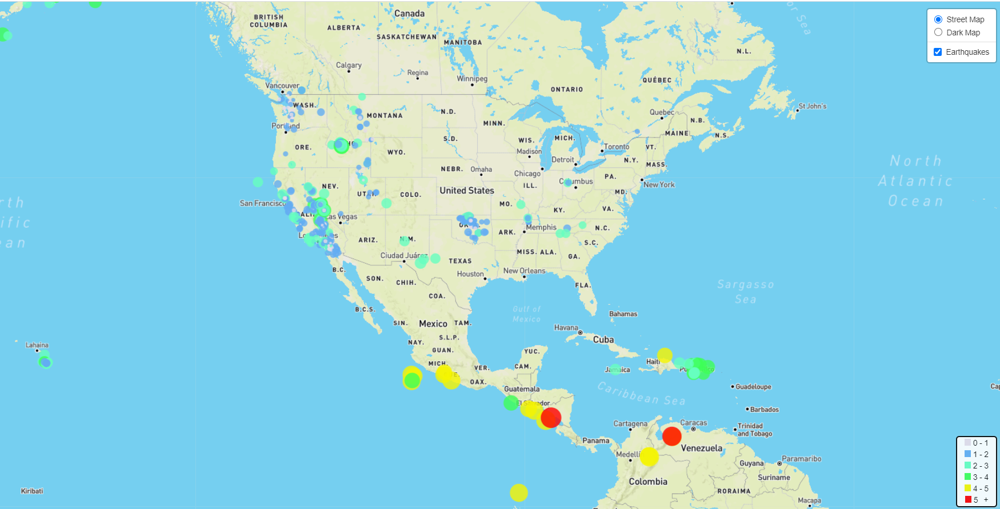
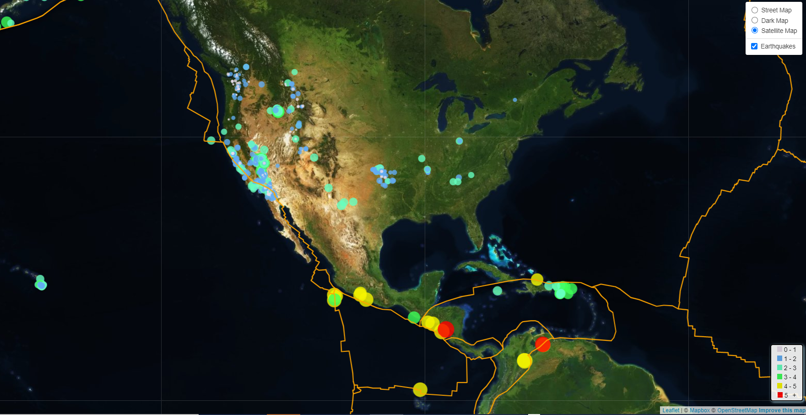

# Leaflet Challenge 

## Data Visualization using Leaflet
 
The USGS was interested in building a new set of tools that allow them to visualize their earthquake data. Bear in mind that the dataset is updated every 5 min. Through this assisgnment I was able to display the earthquake data using Leaflet.

These maps allow you to visualize 'All Earthquakes from the Past Week' over the light and dark street maps, as well as satellite maps. Please go through the maps! 

The 2nd step shows you the relationship between the erthquakes and plate tectonics, pretty interesting!

